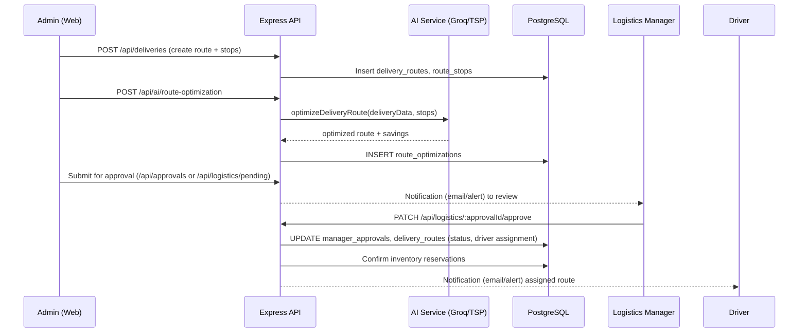

# EcoTrackAI System Diagrams

This document captures the key diagrams for the EcoTrackAI platform (backend in `ecotrackai-backend`, frontend in `ecotrackai-frontend`). Each diagram stays aligned with the current codebase: Node.js/Express API, PostgreSQL, Groq-powered AI service, Cloudinary media storage, and Nodemailer notifications.

---

## 1) Use Case Diagram

```mermaid
flowchart LR
  classDef actor fill:#f7f7f7,stroke:#555,stroke-width:1px;
  classDef usecase fill:#e9f5ff,stroke:#1f78c1,stroke-width:1px;

  Admin([Admin]):::actor
  Manager([Logistics Manager]):::actor
  Driver([Driver]):::actor
  External([External Carbon/AI API]):::actor

  UC1((Manage Inventory)):::usecase
  UC2((Plan Delivery Routes)):::usecase
  UC3((Optimize Route (AI))):::usecase
  UC4((Approve/Decline Route)):::usecase
  UC5((Monitor Drivers)):::usecase
  UC6((View Carbon & Spoilage Insights)):::usecase

  Admin --> UC1
  Admin --> UC2
  Admin --> UC3
  Admin --> UC6
  Manager --> UC4
  Manager --> UC5
  Driver --> UC5
  External --> UC3
```

---

## 2) Sequence Diagram — Route Optimization & Approval



---

## 3) High-Level Architecture Diagram (with FR & NFR)

```mermaid
flowchart LR
  classDef svc fill:#eef6ea,stroke:#4a7a43,stroke-width:1px;
  classDef data fill:#fff6e5,stroke:#c47a00,stroke-width:1px;
  classDef ext fill:#f4e9ff,stroke:#7a4ac4,stroke-width:1px;
  classDef fr fill:#e4ffe4,stroke:#2f7b2f,stroke-width:1px,stroke-dasharray: 3 2;
  classDef nfr fill:#fff3f3,stroke:#c0392b,stroke-width:1px,stroke-dasharray: 3 2;

  subgraph Client
    FE[Web App (ecotrackai-frontend)]:::svc
  end

  subgraph API["Express API (Node.js)"]
    Auth[Auth & JWT]:::svc
    Inv[Inventory & Catalog]:::svc
    Logi[Logistics & Route Optimization]:::svc
    Carbon[Carbon & Analytics]:::svc
    Alerts[Alerts & Notifications]:::svc
    Cron[Spoilage Risk Cron]:::svc
  end

  DB[(PostgreSQL)]:::data
  Media[(Cloudinary Storage)]:::data
  Email[(SMTP/Nodemailer)]:::ext
  Groq[(Groq API - LLM)]:::ext

  FE -->|HTTPS/JSON| Auth
  FE --> Inv
  FE --> Logi
  FE --> Carbon
  Auth --> DB
  Inv --> DB
  Logi --> DB
  Carbon --> DB
  Alerts --> Email
  Logi --> Groq
  Inv --> Media
  Cron --> Alerts

  FR1[FR1: Manager approves optimized route (assign driver, lock inventory) — see logistics.service.js::approveRoute]:::fr
  NFR1[NFR1: API P95 < 300ms & 99.9% uptime (health check, pooling, cron isolation)]:::nfr

  FE -. reviews route status .-> FR1
  FR1 -. enforces business rule .-> Logi
  API -. monitors .-> NFR1
```

**FR placement:** FR1 is anchored on the Logistics service and reflected to the frontend review flow.  
**NFR placement:** NFR1 is tied to the whole API node (health check `/api/health`, connection pooling in `config/database.js`, and keeping cron lightweight).

---

## 4) Traceability to Code
- Route approval logic (FR1): `ecotrackai-backend/src/services/logistics.service.js:approveRoute`
- Pending/approval endpoints: `ecotrackai-backend/src/routes/logistics.routes.js`
- AI optimization: `ecotrackai-backend/src/services/ai.service.js` and `src/routes/ai.routes.js`
- Cron for spoilage risk: `ecotrackai-backend/src/app.js`
- Persistence: `ecotrackai-backend/src/config/database.js` (PostgreSQL with optional `DATABASE_URL`)
- Media & email: Cloudinary (`multer-storage-cloudinary`), Nodemailer (`src/services/email.service.js`) hooked via Alerts service.

---

## How to view
Open this file in VS Code with the Markdown Preview (`Ctrl+Shift+V`) to render the Mermaid diagrams. If Mermaid isn’t enabled, install a Markdown Mermaid extension or paste the blocks into https://mermaid.live for quick viewing.
